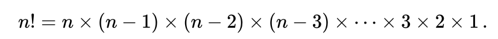
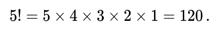

# Faktorial

Dalam matematika, Faktorial dari bilangan bulat positif dari n yang dilambangkan dengan n!, adalah produk dari semua bilangan bulat positif yang kurang dari atau sama dengan n:<sup id="pg1">[1](#fn1)</sup>.
<br>

Sebagai contoh,
<br>

<br>
Nilai 0! adalah 1, menurut konvensi untuk produk kosong.

Pada studi kasus faktorial yang ada di *source code* [ini](Factorial.php), ada 3 metode yang bisa digunakan untuk menghitung nilai faktorial dari n yang diberikan. Metode tersebut di antaranya adalah:

## Metode *loop*<sup id="pg2">[2](#fn2)</sup>
Di metode ini, kita menggunakan cara yang paling standar yaitu menggunakan perulangan. Contohnya dapat dilihat pada *source code* di bawah ini.
```php
if ($value <= 1) {
    return 1;
}

$result = 1;

for ($n = $value; $n >= 1; $n--) {
    $result *= $n;
}

return $result;
```

## Metode *recursive*<sup id="pg2">[2](#fn2)</sup>
Jika pada saat interview kita dilarang untuk menggunakan perulangan, kita bisa menggunakan cara rekursif. Rekursif adalah fungsi yang memanggil fungsi itu sendiri secara berulang. Contohnya dapat dilihat pada *source code* di bawah ini.
```php
$this->initialN = 5;

public function resultWithRecursive(): int
{
    if ($this->initialN <= 1) {
        return 1;
    }

    $n = $this->initialN;

    return $n * $this->resultWithRecursive($this->initialN = $n - 1);
}
```

## Metode *tail recursive*<sup id="pg2">[2](#fn2)</sup>
Jika kita perhatikan pada metode rekursif sebelumnya, kita bisa lihat bahwa fungsi tersebut harus menunggu hingga ke fungsi rekursif yang paling akhir di setiap ia memanggil dirinya sendiri.
```php
$this->initialN = 5;

$this->resultWithRecursive();
// 5 * ($this->resultWithRecursive() = 4)
// 5 * 4 * ($this->resultWithRecursive() = 3)
// 5 * 4 * 3 * ($this->resultWithRecursive() = 2)
// 5 * 4 * 3 * 2 * ($this->resultWithRecursive() = 1)
// 5 * 4 * 3 * 2 * 1 * ($this->resultWithRecursive() = 0)
```
Salah satu masalah yang bisa muncul ketika kita menggunakan metode rekursif adalah terjadinya *memory leak*. Solusi yang bisa digunakan adalah menggunakan *tail recursive*. *Tail recursive* adalah rekursif yang seakan-akan tidak menunggu rekursif sebelumnya. Sehingga hasil eksekusinya akan menjadi seperti berikut ini.
```php
$this->initialN = 5;

$this->resultWithTailRecursive();
// $this->resultWithTailRecursive() // $this->iniitalN = 5, $this->result = 1
// $this->resultWithTailRecursive() // $this->iniitalN = 4, $this->result = 5
// $this->resultWithTailRecursive() // $this->iniitalN = 3, $this->result = 20
// $this->resultWithTailRecursive() // $this->iniitalN = 2, $this->result = 60
// $this->resultWithTailRecursive() // $this->iniitalN = 1, $this->result = 120
// $this->resultWithTailRecursive() // $this->iniitalN = 0, $this->result = 120
```

Contoh dari metode *tail recursive* dapat dilihat pada *source code* di bawah ini.
```php
$this->initialN = 5;

public function resultWithTailRecursive(): int
{
    if ($this->initialN <= 0) {
        return $this->result;
    }

    $this->result *= $this->initialN;
    $this->initialN--;

    return $this->resultWithTailRecursive();
}
```

---
### Catatan Kaki:

<strong id="fn1">1</strong> [Faktorial, Wikipedia](https://id.wikipedia.org/wiki/Faktorial). [↩](#pg1)
<br>
<strong id="fn2">2</strong> [Programmer Zaman Now - Coding Interview Factorial (UNLISTED)](https://www.youtube.com/watch?v=tcPmCOAl-X4). [↩](#pg2)
<br>
